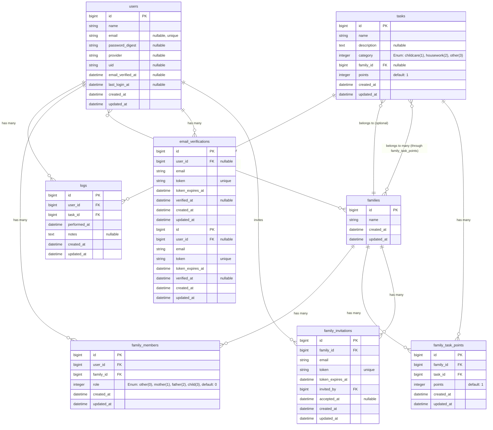

# FamilyOps データベース定義書

## 概要

FamilyOpsアプリケーションのデータベーススキーマ定義書です。テーブル構造とリレーションシップを記載しています。

## テーブル一覧

- [users](#users)
- [email_verifications](#email_verifications)
- [tasks](#tasks)
- [logs](#logs)
- [families](#families)
- [family_members](#family_members)
- [family_task_points](#family_task_points)
- [family_invitations](#family_invitations)

## テーブル定義

### users

ユーザー情報を管理するテーブル。パスワード認証とOAuth認証の両方に対応。

| カラム名 | 論理名 | 型 | NULL | デフォルト | 説明 |
|---------|--------|-----|------|-----------|------|
| id | ID | bigint | false | - | 主キー |
| name | ユーザー名 | string | false | - | - |
| email | メールアドレス | string | true | - | ユニーク制約あり、パスワード認証時は必須 |
| password_digest | パスワードハッシュ | string | true | - | パスワード認証時は必須 |
| provider | OAuthプロバイダー名 | string | true | - | 例: "google" |
| uid | OAuthユーザーID | string | true | - | OAuthプロバイダー側のユーザーID |
| email_verified_at | メールアドレス確認日時 | datetime | true | - | メールアドレス確認完了日時 |
| last_login_at | 最終ログイン日時 | datetime | true | - | - |
| created_at | 作成日時 | datetime | false | - | - |
| updated_at | 更新日時 | datetime | false | - | - |

**インデックス:**
- `users_email_unique` (UNIQUE): `email`
- `users_provider_uid_unique` (UNIQUE, 部分インデックス): `[provider, uid]` WHERE `provider IS NOT NULL`

**制約:**
- パスワード認証またはOAuth認証のどちらかは必須（アプリケーションレベルでバリデーション）

---

### email_verifications

メールアドレス確認用トークンを管理するテーブル。一時的なデータのため、確認完了後は削除される。

| カラム名 | 論理名 | 型 | NULL | デフォルト | 説明 |
|---------|--------|-----|------|-----------|------|
| id | ID | bigint | false | - | 主キー |
| user_id | ユーザーID | bigint | true | - | 外部キー: users.id（ユーザー未作成時はNULL） |
| email | メールアドレス | string | false | - | 確認対象のメールアドレス |
| token | 確認トークン | string | false | - | ユニーク制約あり |
| token_expired_at | トークン有効期限 | datetime | false | - | - |
| verified_at | 確認日時 | datetime | true | - | 確認完了時に設定 |
| created_at | 作成日時 | datetime | false | - | - |
| updated_at | 更新日時 | datetime | false | - | - |

**インデックス:**
- `email_verifications_token_unique` (UNIQUE): `token`
- `email_verifications_email_idx`: `email`
- `email_verifications_user_id_idx`: `user_id`

**外部キー制約:**
- `email_verifications_user_id_fk`: `users.id` ON DELETE CASCADE（NULL可）

**特徴:**
- メールアドレス確認時にユーザーが未作成の可能性があるため、`user_id`はNULL許可
- 確認完了後、トークンレコードは削除（または`verified_at`を設定して保持）
- `users.email_verified_at`に確認日時を記録

---

### tasks

タスク情報を管理するテーブル。全家族共通のタスクと家族固有のタスクを管理する。

| カラム名 | 論理名 | 型 | NULL | デフォルト | 説明 |
|---------|--------|-----|------|-----------|------|
| id | ID | bigint | false | - | 主キー |
| name | タスク名 | string | false | - | - |
| description | 説明 | text | true | - | - |
| category | カテゴリ | integer | false | 0 | Enum: childcare=1, housework=2, other=3 |
| family_id | 家族ID | bigint | true | - | 外部キー: families.id（NULLの場合は全家族共通のタスク） |
| points | デフォルトポイント | integer | false | 1 | デフォルトのポイント数（family_task_pointsで上書き可能） |
| created_at | 作成日時 | datetime | false | - | - |
| updated_at | 更新日時 | datetime | false | - | - |

**インデックス:**
- `tasks_category_idx`: `category`
- `tasks_family_id_fk`: `family_id`

**外部キー制約:**
- `tasks_family_id_fk`: `families.id` ON DELETE CASCADE

**Enum定義:**
- `childcare` (1): 育児
- `housework` (2): 家事
- `other` (3): その他

---

### logs

タスクの実行ログを管理するテーブル。

| カラム名 | 論理名 | 型 | NULL | デフォルト | 説明 |
|---------|--------|-----|------|-----------|------|
| id | ID | bigint | false | - | 主キー |
| user_id | ユーザーID | bigint | false | - | 外部キー: users.id |
| task_id | タスクID | bigint | false | - | 外部キー: tasks.id |
| performed_at | 実行日時 | datetime | false | - | - |
| notes | 備考 | text | true | - | - |
| created_at | 作成日時 | datetime | false | - | - |
| updated_at | 更新日時 | datetime | false | - | - |

**インデックス:**
- `logs_user_id_fk`: `user_id`
- `logs_task_id_fk`: `task_id`
- `logs_performed_at_idx`: `performed_at`
- `logs_user_id_performed_at_idx`: `[user_id, performed_at]`
- `logs_task_id_performed_at_idx`: `[task_id, performed_at]`

**外部キー制約:**
- `logs_user_id_fk`: `users.id` ON DELETE RESTRICT
- `logs_task_id_fk`: `tasks.id` ON DELETE RESTRICT

---

### families

家族情報を管理するテーブル。

| カラム名 | 論理名 | 型 | NULL | デフォルト | 説明 |
|---------|--------|-----|------|-----------|------|
| id | ID | bigint | false | - | 主キー |
| name | 家族名 | string | false | - | - |
| created_at | 作成日時 | datetime | false | - | - |
| updated_at | 更新日時 | datetime | false | - | - |

---

### family_members

家族メンバーの関連情報を管理するテーブル。ユーザーと家族の多対多の関係を表現。

| カラム名 | 論理名 | 型 | NULL | デフォルト | 説明 |
|---------|--------|-----|------|-----------|------|
| id | ID | bigint | false | - | 主キー |
| user_id | ユーザーID | bigint | false | - | 外部キー: users.id |
| family_id | 家族ID | bigint | false | - | 外部キー: families.id |
| role | 役割 | integer | false | 0 | Enum: other=0, mother=1, father=2, child=3 |
| created_at | 作成日時 | datetime | false | - | - |
| updated_at | 更新日時 | datetime | false | - | - |

**インデックス:**
- `family_members_family_id_fk`: `family_id`
- `family_members_user_id_family_id_unique` (UNIQUE): `[user_id, family_id]`

**外部キー制約:**
- `family_members_user_id_fk`: `users.id` ON DELETE CASCADE
- `family_members_family_id_fk`: `families.id` ON DELETE CASCADE

**Enum定義:**
- `other` (0): その他（デフォルト）
- `mother` (1): 母親
- `father` (2): 父親
- `child` (3): 子

---

### family_task_points

家族ごとのタスクポイント設定を管理するテーブル。家族とタスクの多対多の関係を表現。`tasks.points`の上書き設定。

| カラム名 | 論理名 | 型 | NULL | デフォルト | 説明 |
|---------|--------|-----|------|-----------|------|
| id | ID | bigint | false | - | 主キー |
| family_id | 家族ID | bigint | false | - | 外部キー: families.id |
| task_id | タスクID | bigint | false | - | 外部キー: tasks.id |
| points | ポイント数 | integer | false | 1 | 家族固有のポイント設定（tasks.pointsの上書き） |
| created_at | 作成日時 | datetime | false | - | - |
| updated_at | 更新日時 | datetime | false | - | - |

**インデックス:**
- `family_task_points_family_id_fk`: `family_id`
- `family_task_points_family_id_task_id_unique` (UNIQUE): `[family_id, task_id]`

**外部キー制約:**
- `family_task_points_family_id_fk`: `families.id` ON DELETE CASCADE
- `family_task_points_task_id_fk`: `tasks.id` ON DELETE RESTRICT

---

## ER図

## リレーションシップ

### 1対多の関係

- `users` → `logs`: 1人のユーザーは複数のログを持つ（ON DELETE RESTRICT）
- `users` → `family_members`: 1人のユーザーは複数の家族に所属できる（ON DELETE CASCADE）
- `users` → `email_verifications`: 1人のユーザーは複数の確認トークンを持つ（ON DELETE CASCADE、ユーザー未作成時はNULL）
- `users` → `family_invitations`: 1人のユーザーは複数の招待を送信できる（ON DELETE CASCADE、invited_by）
- `tasks` → `logs`: 1つのタスクは複数のログを持つ（ON DELETE RESTRICT）
- `tasks` → `family_task_points`: 1つのタスクは複数の家族でポイント設定される（ON DELETE RESTRICT）
- `families` → `tasks`: 1つの家族は複数のタスクを持つ（ON DELETE CASCADE、family_idがNULLの場合は全家族共通）
- `families` → `family_members`: 1つの家族は複数のメンバーを持つ（ON DELETE CASCADE）
- `families` → `family_task_points`: 1つの家族は複数のタスクポイント設定を持つ（ON DELETE CASCADE）
- `families` → `family_invitations`: 1つの家族は複数の招待を持つ（ON DELETE CASCADE）

### 多対多の関係

- `users` ↔ `families` (中間テーブル: `family_members`): 1人のユーザーは複数の家族に所属でき、1つの家族は複数のユーザーを持つ
- `families` ↔ `tasks` (中間テーブル: `family_task_points`): 1つの家族は複数のタスクのポイント設定を持ち、1つのタスクは複数の家族でポイント設定される

## 削除時の動作

### CASCADE（親レコード削除時に子レコードも削除）

- `users` 削除時 → `family_members`, `email_verifications`, `family_invitations`（招待者として）も削除
- `families` 削除時 → `tasks`（家族固有のタスク）, `family_members`, `family_task_points`, `family_invitations` も削除

### RESTRICT（親レコード削除時にエラー）

- `users` 削除時 → `logs` が存在する場合は削除不可
- `tasks` 削除時 → `logs`, `family_task_points` が存在する場合は削除不可

## 注意事項

1. **users テーブルの認証**
   - パスワード認証とOAuth認証のどちらかは必須（アプリケーションレベルでバリデーション）
   - パスワード認証の場合は `password_digest` と `email` が必須
   - OAuth認証の場合は `provider` と `uid` が必須

2. **family_members テーブル**
   - `user_id` と `family_id` の組み合わせはユニーク（1人のユーザーは同じ家族に1回のみ所属可能）

3. **family_task_points テーブル**
   - `family_id` と `task_id` の組み合わせはユニーク（1つの家族は同じタスクのポイントを1つだけ設定可能）
   - 家族固有のポイント設定（`tasks.points` の上書き）
   - 設定がない場合は `tasks.points` が使用される

4. **tasks テーブル**
   - `family_id` が NULL の場合は全家族共通のタスク
   - `family_id` が設定されている場合はその家族固有のタスク（他の家族には表示されない）
   - `points` はデフォルトのポイント数（全家族共通タスクのデフォルトポイント）
   - 家族固有のポイント設定は `family_task_points` テーブルで管理
   - ポイント取得時は `family_task_points` を優先、なければ `tasks.points` を使用

5. **family_task_points テーブル**
   - 家族ごとのタスクポイント設定（`tasks.points` の上書き）
   - `family_task_points` に設定がない場合は `tasks.points` が使用される

6. **logs テーブル**
   - `user_id` と `task_id` の削除は制限されているため、事前にログを削除する必要がある

7. **email_verifications テーブル**
   - メールアドレス確認用の一時的なトークンを管理
   - ユーザー未作成時でもトークンを発行可能（`user_id`はNULL許可）
   - 確認完了後は削除（または`verified_at`を設定して保持）
   - `users.email_verified_at`に確認日時を記録
   - 期限切れトークンは定期バッチで削除推奨

8. **family_invitations テーブル**
   - 家族への招待トークンを一時的に管理
   - 招待受諾後は削除（または`accepted_at`を設定して保持）
   - 同じメールアドレスへの重複招待を防ぐため、未受諾の招待は1件のみ有効にする設計が推奨
   - 期限切れトークンは定期バッチで削除推奨

