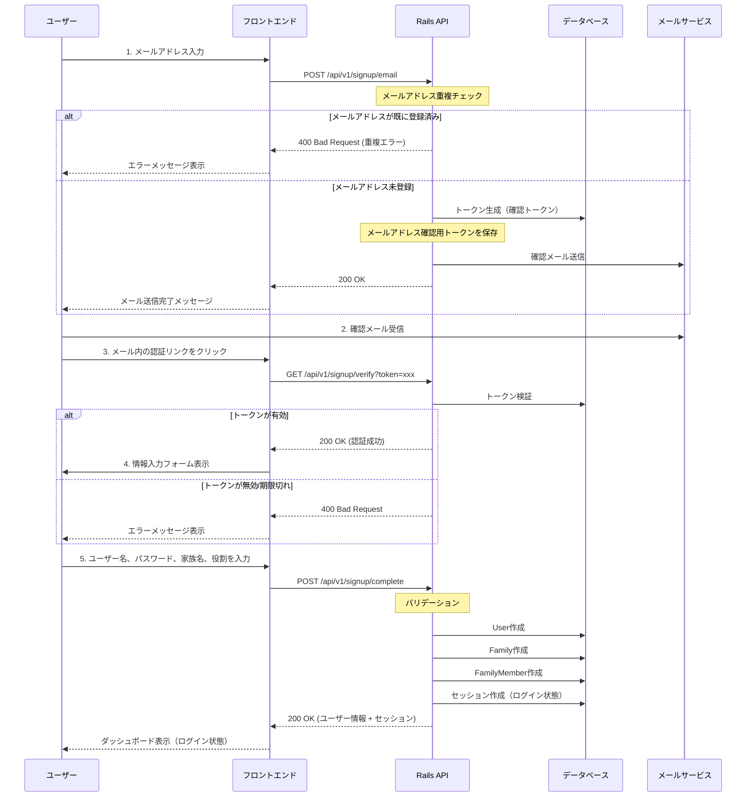
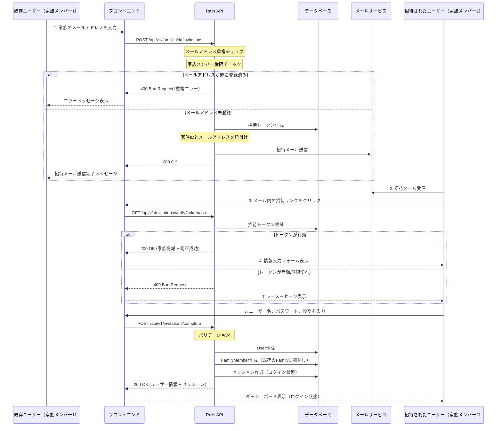

# サインアップフロー

FamilyOpsアプリケーションのサインアップフロー図

## 1. 画面からサインアップ（最初の家族メンバー）

## 2. 招待によるサインアップ（二人目以降の家族メンバー）

## データベース設計の検討事項

### 必要なテーブル・カラム

#### 1. Userテーブル
- 既存カラム: `email`, `name`, `password_digest`, `provider`, `uid`
- **追加が必要**: 
  - `email_verified_at` (datetime, null: true) - メールアドレス確認日時（確認完了日時を永続化）

#### 2. EmailVerificationテーブル（新規作成）
- `id` (bigint, primary key)
- `user_id` (bigint, foreign key, null: true) - ユーザーID（ユーザー未作成時はNULL）
- `email` (string, null: false) - 確認対象のメールアドレス
- `token` (string, null: false, unique) - 確認トークン
- `token_expires_at` (datetime, null: false) - トークン有効期限
- `verified_at` (datetime, null: true) - 確認完了日時
- `created_at` (datetime)
- `updated_at` (datetime)
- インデックス: `token` (UNIQUE), `email`, `user_id`

**設計思想:**
- トークンは一時的なデータのため、専用テーブルで管理
- 確認完了後は削除（または`verified_at`を設定）
- ユーザー未作成時でもトークンを発行可能（初期サインアップに対応）

詳細は `DOCS/email_verification_design.md` を参照

#### 3. FamilyInvitationテーブル（新規作成）
- `id` (bigint, primary key)
- `family_id` (bigint, foreign key) - 招待元の家族ID
- `email` (string, null: false) - 招待先のメールアドレス
- `token` (string, null: false, unique) - 招待トークン
- `token_expires_at` (datetime, null: false) - トークン有効期限
- `invited_by` (bigint, foreign key to users) - 招待したユーザーID
- `accepted_at` (datetime, null: true) - 招待受諾日時
- `created_at` (datetime)
- `updated_at` (datetime)
- インデックス: `token`, `email`, `family_id`

## APIエンドポイント

### 1. 画面からのサインアップ

#### メールアドレス登録
- `POST /api/v1/signup/email`
- Request: `{ email: "user@example.com" }`
- Response: `{ message: "確認メールを送信しました" }`

#### メールアドレス認証
- `GET /api/v1/signup/verify?token=xxx`
- Response: `{ verified: true, email: "user@example.com" }`

#### ユーザー情報登録完了
- `POST /api/v1/signup/complete`
- Request: `{ token: "xxx", name: "ユーザー名", password: "password", password_confirmation: "password", family_name: "家族名", role: "mother" }`
- Response: `{ user: {...}, family: {...}, logged_in: true }`

### 2. 招待によるサインアップ

#### 招待メール送信
- `POST /api/v1/families/:id/invitations`
- Request: `{ email: "invited@example.com" }`
- Response: `{ message: "招待メールを送信しました" }`

#### 招待トークン検証
- `GET /api/v1/invitations/verify?token=xxx`
- Response: `{ verified: true, family: {...}, email: "invited@example.com" }`

#### 招待受諾完了
- `POST /api/v1/invitations/complete`
- Request: `{ token: "xxx", name: "ユーザー名", password: "password", password_confirmation: "password", role: "father" }`
- Response: `{ user: {...}, family: {...}, logged_in: true }`

